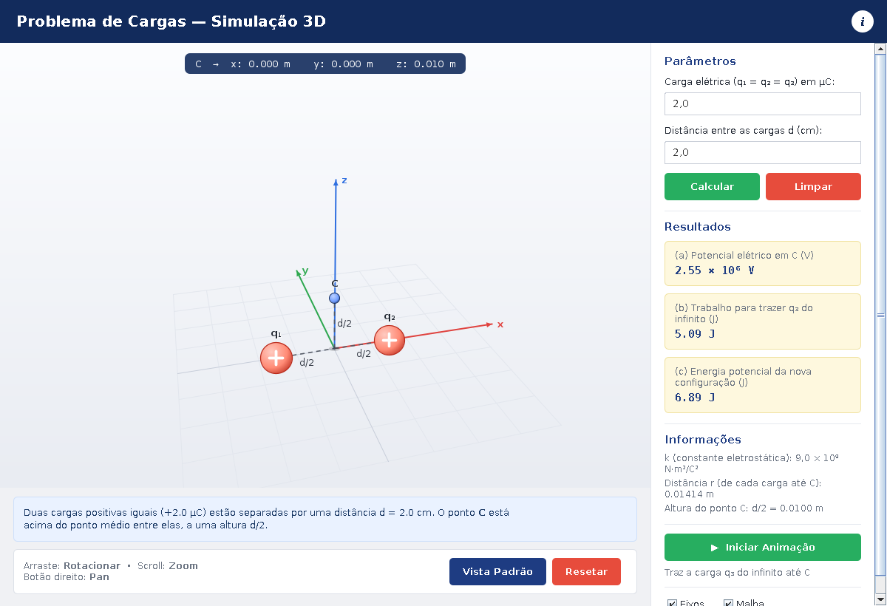
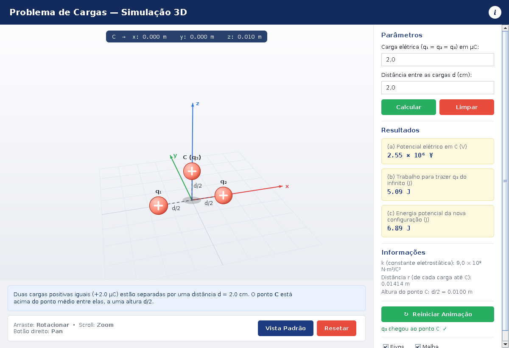

# ⚡ Problema de Cargas — Simulação 3D

Simulação interativa em **Java puro (Swing + Java2D)** do clássico problema de
eletrostática: duas cargas elétricas fixas e o cálculo do potencial elétrico,
trabalho e energia potencial em um ponto acima delas. A cena 3D — rotação,
zoom, pan, eixos, malha do chão e até uma animação da terceira carga "vindo
do infinito" — foi construída inteiramente do zero, sem nenhuma biblioteca
gráfica externa (sem JavaFX, sem Java3D, sem LWJGL/OpenGL).



## 📐 O problema

> Duas cargas `q = +2,0 μC` são mantidas fixas a uma distância `d = 2,0 cm`
> uma da outra. O ponto **C** está localizado acima do ponto médio entre
> elas, a uma altura `d/2`.
>
> **(a)** Com `V = 0` no infinito, qual é o potencial elétrico no ponto C?
> **(b)** Qual é o trabalho necessário para deslocar uma terceira carga
> `q = +2,0 μC` do infinito até o ponto C?
> **(c)** Qual é a energia potencial `U` da nova configuração?

*(Problema 88 — Halliday, Resnick e Walker, capítulo de Potencial Elétrico)*

A aplicação resolve o problema para **qualquer** valor de carga e distância
informado pelo usuário, não apenas para os valores do enunciado original.

## ✨ Funcionalidades

- **Cena 3D construída do zero** — câmera orbital própria (rotação, zoom,
  pan), projeção em perspectiva, ordenação pintor (*painter's algorithm*),
  sombras e gradientes radiais para dar volume às esferas, tudo feito "na
  unha" com `Graphics2D`.
- **Cálculo em tempo real** — os resultados (a), (b) e (c) são recalculados
  a cada tecla digitada, sem precisar clicar em nenhum botão.
- **Animação da terceira carga** — o botão *Iniciar Animação* traz
  visualmente a carga `q₃` "do infinito" até o ponto C, demonstrando o que
  o item (b) do problema está, de fato, calculando.
- **Câmera interativa** — arraste para rotacionar, scroll para zoom, botão
  direito para *pan* (mover a câmera), igual a qualquer software de CAD.
- **Eixos e malha opcionais** — checkboxes para mostrar/ocultar os eixos
  coordenados e a grade do chão.
- **Validação amigável** — campos vazios ou inválidos não derrubam a
  aplicação: os resultados mostram `—` até que valores válidos sejam
  digitados.
- **Interface 100% responsiva** — a janela pode ser redimensionada
  livremente; a barra lateral usa rolagem automática se o conteúdo não
  couber na altura disponível.



## 🧠 Como o problema é resolvido

Sejam `q` a carga (em Coulombs) e `d` a distância entre as duas cargas fixas
(em metros). O ponto C fica a uma altura `d/2` acima do ponto médio entre
elas, então a distância de **cada** carga até C é, por Pitágoras:

```
r = √((d/2)² + (d/2)²) = d / √2
```

- **(a) Potencial elétrico em C** — soma do potencial gerado por cada carga:
  `V = 2kq / r`
- **(b) Trabalho para trazer q₃ do infinito até C** — para uma carga de
  prova `q₃ = q`, o trabalho realizado é `W = q·V`
- **(c) Energia potencial da nova configuração** — soma da energia entre
  o par original (`q₁q₂`) mais a energia de `q₃` com cada uma das outras
  duas cargas:
  `U = k·q² · (1/d + 2/r)`

onde `k = 9,0 × 10⁹ N·m²/C²`. Toda essa lógica fica isolada, sem nenhuma
dependência de Swing, na classe [`Fisica.java`](src/Fisica.java) — o que
facilita testá-la ou reaproveitá-la separadamente da interface gráfica.

## 🏗️ Arquitetura do projeto

O projeto foi dividido em classes pequenas e com responsabilidade única,
em vez de uma única classe gigante — pensando em legibilidade e em poder
evoluir a aplicação no futuro (ex.: trocar para outro tipo de problema de
cargas, adicionar mais pontos, etc.):

| Classe | Responsabilidade |
|---|---|
| [`ProblemaDeFisica`](src/ProblemaDeFisica.java) | Classe principal (`main`). Apenas cria a janela (`JFrame`). |
| [`PainelPrincipal`](src/PainelPrincipal.java) | Monta o layout geral: cabeçalho, cena 3D, descrição e barra lateral. |
| [`Cena3D`](src/Cena3D.java) | O "motor" 3D: desenha eixos, malha, cargas e trata mouse/scroll. |
| [`Camera3D`](src/Camera3D.java) | Câmera orbital: rotação, zoom, pan e projeção em perspectiva. |
| [`Ponto3D`](src/Ponto3D.java) | Vetor/ponto 3D imutável usado pela cena e pela câmera. |
| [`Fisica`](src/Fisica.java) | Toda a matemática do problema — sem nenhuma dependência gráfica. |
| [`PainelLateral`](src/PainelLateral.java) | Parâmetros, resultados, informações e controle da animação. |
| [`Paleta`](src/Paleta.java) | Cores e fontes centralizadas, para manter a identidade visual. |
| [`Cartao`](src/Cartao.java) / [`BotaoArredondado`](src/BotaoArredondado.java) | Componentes Swing reutilizáveis (cantos arredondados). |

Nenhuma biblioteca externa é usada — apenas `javax.swing`, `java.awt` e
`java.awt.geom`, todos parte do JDK padrão.

## ▶️ Como executar

### Opção 1 — usando o `.jar` pronto

```bash
java -jar dist/ProblemaDeFisica.jar
```

### Opção 2 — compilando o código-fonte

```bash
cd src
javac -d ../out *.java
cd ../out
java ProblemaDeFisica
```

### Opção 3 — pelo VS Code

O projeto já vem com a pasta `.vscode/` configurada:

- **Com a [Extension Pack for Java](https://marketplace.visualstudio.com/items?itemName=vscjava.vscode-java-pack)** (recomendado): abra a pasta do projeto no VS Code, abra `src/ProblemaDeFisica.java` e aperte **F5** (ou use o botão *Run* que aparece acima do `main`).
- **Sem a extensão Java**: pressione **Ctrl+Shift+B** (ou **Cmd+Shift+B** no Mac) para compilar, e depois rode a task **Executar** em *Terminal → Run Task*. Essas tasks usam só `javac`/`java` puro, então funcionam mesmo sem nenhuma extensão instalada.

Requer **Java 17 ou superior** (testado com OpenJDK 21). Nenhuma
dependência externa precisa ser instalada.

## 🖱️ Controles da cena 3D

| Ação | Controle |
|---|---|
| Rotacionar a câmera | Arrastar com o botão **esquerdo** do mouse |
| Zoom | Scroll do mouse |
| Mover a câmera (*pan*) | Arrastar com o botão **direito** do mouse |
| Voltar ao ângulo inicial | Botão **Vista Padrão** |
| Resetar tudo (parâmetros + câmera + animação) | Botão **Resetar** |

## 📁 Estrutura de pastas

```
.
├── .vscode/              # Configuração pronta para rodar/debugar no VS Code
├── src/                  # Código-fonte (.java)
├── dist/
│   └── ProblemaDeFisica.jar
├── screenshots/
└── README.md
```

## 🚀 Possíveis evoluções

- Generalizar para **N cargas** em posições arbitrárias, definidas pelo
  usuário diretamente na cena 3D.
- Exportar a cena como imagem (PNG) ou os resultados como PDF/CSV.
- Exibir as linhas de campo elétrico e as superfícies equipotenciais.
- Internacionalização (PT-BR / EN).

## 📚 Sobre este projeto

Este projeto foi desenvolvido como parte de um portfólio de projetos em
Java, explorando Swing/Java2D para construir uma visualização 3D interativa
inteiramente "do zero" — sem motores gráficos prontos — aplicada à
resolução de um problema clássico de Física (eletrostática).

---

*Sinta-se livre para abrir issues, sugerir melhorias ou usar este projeto
como base para os seus próprios estudos de Física ou de Java/Swing.*
